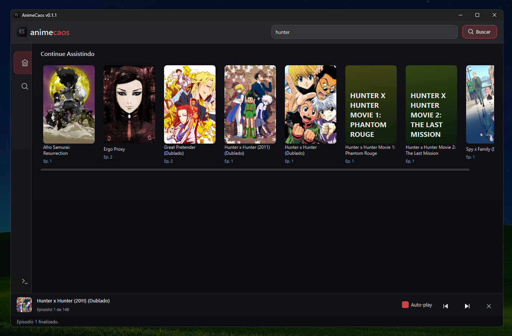
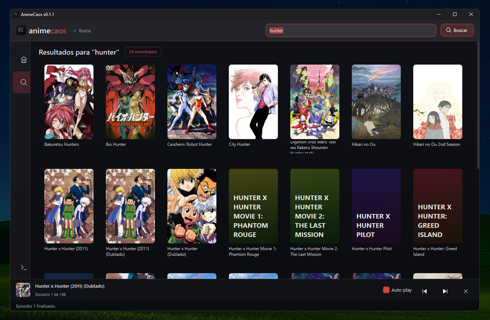
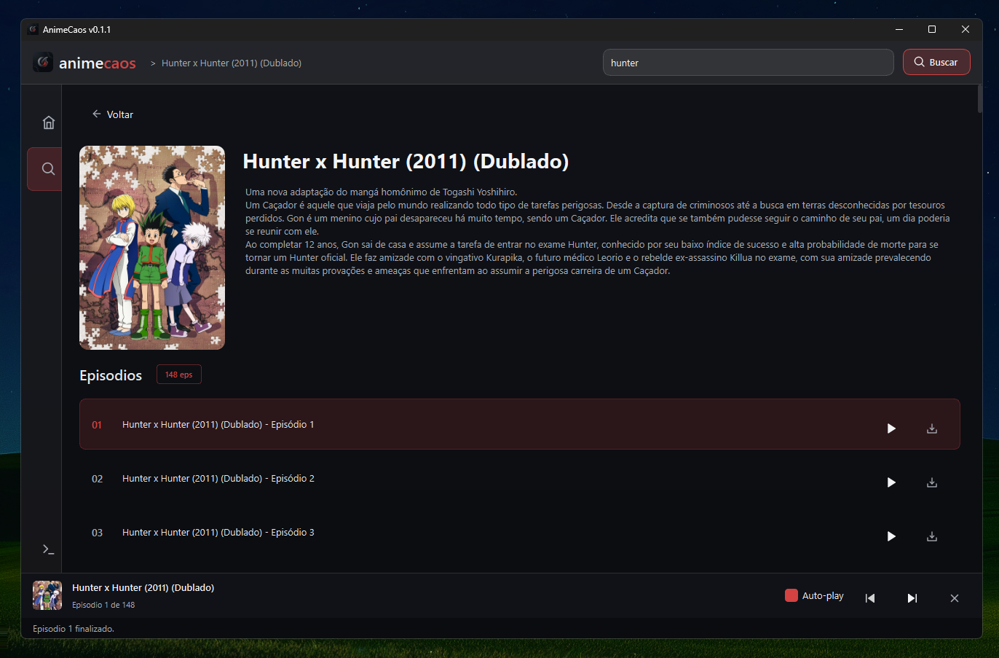

<div align="center">
  

# AnimeCaos

Assista anime no desktop, sem anúncios, sem abrir navegador.

[Website](https://animecaos.vercel.app) · [Instagram](https://www.instagram.com/getanimecaos/) · [Twitter](https://x.com/getanimecaos)


</div>

---

<div align="center">
  
</div>

<br/>

<div align="center">
  
</div>

<br/>

<div align="center">
  
</div>

<br/>

<div align="center">
  
</div>

---

## O que é

AnimeCaos é um app desktop que agrega fontes públicas de anime em uma única interface. Você busca, escolhe o episódio e assiste — sem sair do app, sem anúncio no meio.

Surgiu da necessidade de ter um lugar só pra isso, sem depender de site com popup a cada clique.

---

## Funcionalidades

### Navegação e player

- **Busca e play em ~5s** — player_cache + prefetch do próximo episódio em background
- **Mini player persistente** — flutua sobre outras janelas enquanto você navega no app
- **Autoplay** — próximo episódio começa automaticamente ao fim de cada um
- **Qualidade automática** — MPV prefere 1080p > 720p, HLS pega o bitrate máximo
- **Retomar de onde parou** — abre o episódio certo com scroll automático no histórico

### Conteúdo

- **Home com Em Alta + Temporada Atual** — dados da API pública do AniList
- **Busca inteligente com fallback** — tenta variações via AniList (romaji/english) + fuzzy match
- **Capas dinâmicas** — quando não há capa, gera uma com gradiente + inicial do anime
- **Biblioteca de downloads** — yt-dlp integrado, biblioteca local separada

### Conta e integrações

- **Integração AniList** — OAuth completo, sincroniza histórico e stats automaticamente
- **Discord Rich Presence** — mostra o anime e episódio que você está assistindo no Discord

### App

- **Auto-update** — checa releases no GitHub e baixa a atualização dentro do próprio app
- **Navegação com histórico** — Alt+← volta, botão voltar do mouse funciona, breadcrumb
- **Log panel** — registro de todos os eventos em tempo real para debug
- **Splash screen** com animação no startup
- **Atalhos de teclado** — `Ctrl+F` busca, `Ctrl+←/→` ep anterior/próximo, `Alt+←` voltar, `Escape`

---

## Tecnologias

| | |
|---|---|
| PySide6 | Interface gráfica |
| Selenium | Navegação em páginas dinâmicas |
| Requests + BeautifulSoup | Scraping |
| FuzzyWuzzy | Busca aproximada |
| yt-dlp | Extração de streams |
| mpv | Player de vídeo |

---

## Requisitos

- Python 3.10+
- Mozilla Firefox
- mpv
- geckodriver

Firefox é usado pelos scrapers para lidar com páginas que bloqueiam requests diretos.

---

## Rodando pelo código fonte

```bash
git clone https://github.com/henriqqw/AnimeCaos.git
cd AnimeCaos

python -m venv venv
venv\Scripts\activate  # Windows
# source venv/bin/activate  # Linux/Mac

pip install -r requirements.txt
python main.py
```

---

## Linux (Flatpak)

```bash
git clone https://github.com/henriqqw/AnimeCaos.git
cd AnimeCaos
chmod +x build-flatpak.sh
./build-flatpak.sh

flatpak run com.animecaos.App
```

---

## Build Windows (.exe)

```bash
python build_release.py
```

O executável fica em `dist/Animecaos`.

---

## Licença

MIT
